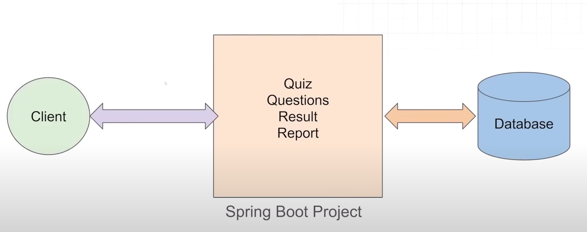
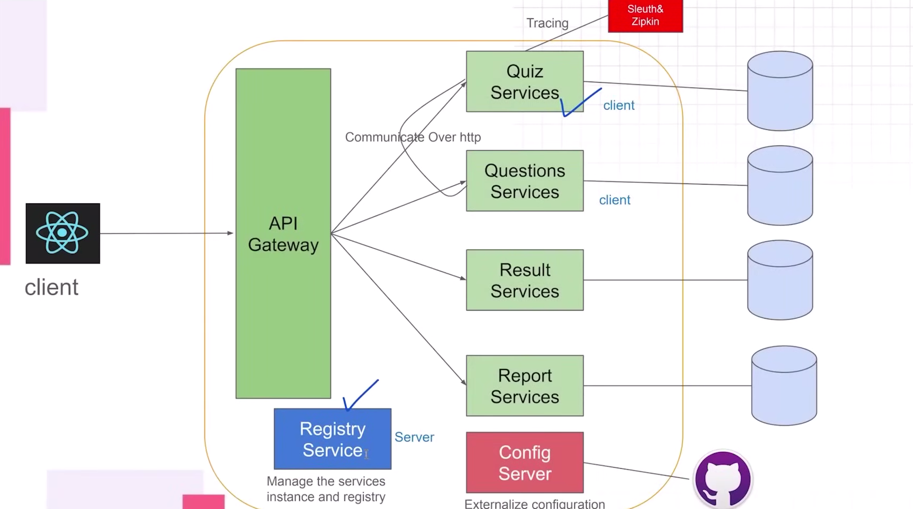

# Micro-services

### Monolithic Architecture

Monolithic architecture is a classic software design pattern where all components of an application—UI, business logic, and data access—are tightly Integrated into a single codebase and deployed as one unit.

###### Disadvantages

* Tight Coupling of Services

 	a) If one service is down other services also get affected

 	b) If one service is planned to redeploy other also got affected

* Scaling Problem
* Technology Problem
* Codebase become complex as project scale

### Microservices Architecture

Software Design Pattern where software is composed of small independent services that communicate over well-defined APIs

* Client <----> API Gateway <--- Quiz services <-----> database(Mysql) -->

 			     <-----> Question Services <-----> database(mongodb)

 			     <-----> Result Services <-----> database(Postgrey)

 			     <-----> Report Services <-----> database(oracle)

 			     <-----> Config Server   <-----> GitHub(Externalize configuration)

 			     <-----> Registry service --> Manages the service instance and registry

###### Registry Service

 	>(it is implemented as Eureka Server and other above services need to implemented as eureka client)

 	> we can balance the load according to traffic or up of instances

> Communicate over http help in communication between two or more services 

* we can use restClient for synchronous and webClient for asynchronous,(openFeign can also be used for both)

> Sleuth \\\& ZipKin :- it helps in Tracing(logs of different services can be seen here)

> if I add sleuth \\\& zipkin in our services then for each request spring cloud sleuth will generate 1 meta data

>Meta data consist of 4 element - Service name, Trace id,Span id,Export Flag

* Service name - micro service instance name
* trace id -  unique id that remains same throughout the microservices for a particular request
* Span id: it is unique per microservices
* Export flag:Boolean indicating whether to export this trace/span to backend
